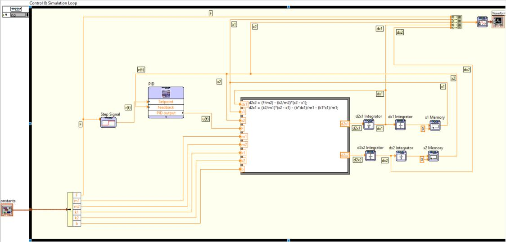
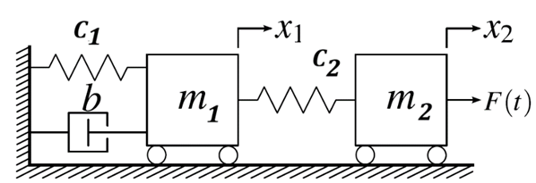
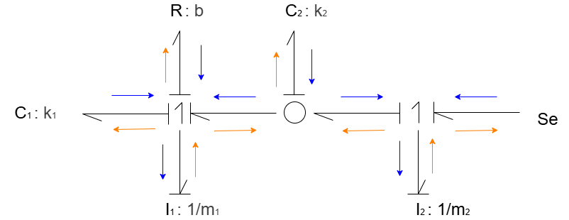
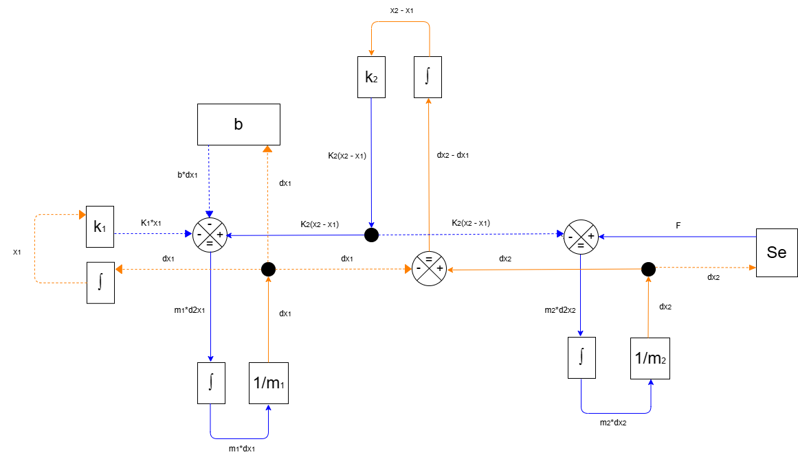
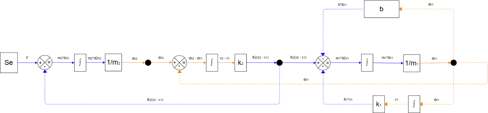
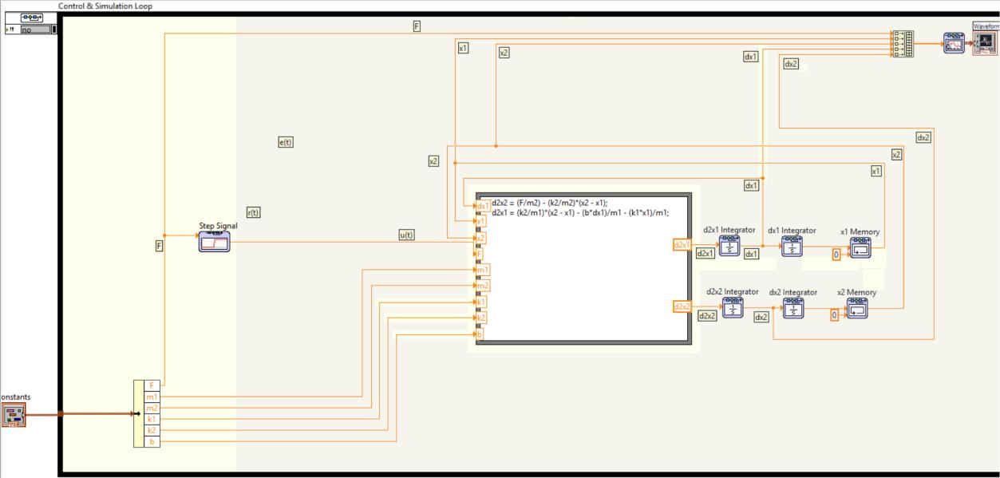
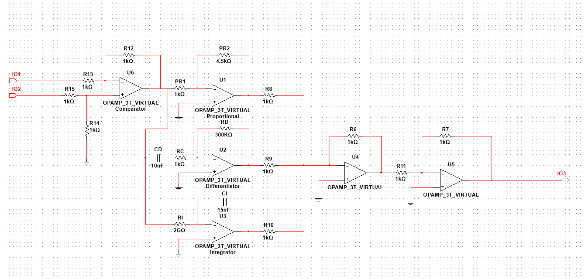
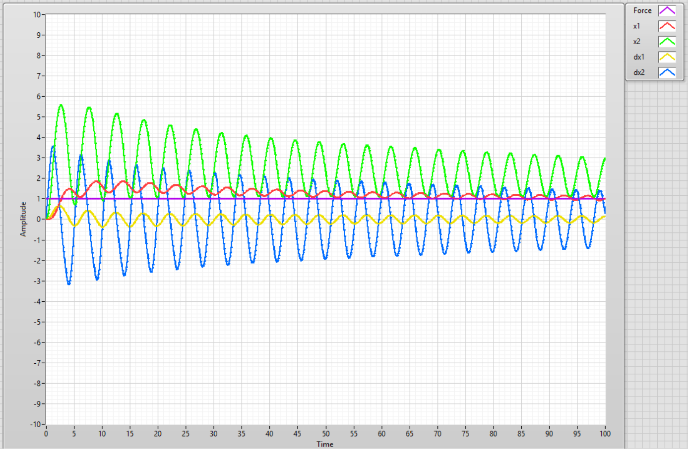

# Software in the Loop (SIL) with NI LabVIEW and Multisim

## Overview

This project involved the modelling, simulation, and control of a mechanical two-mass spring-damper system using LabVIEW and Multisim. The system was modelled using bond graphs, block diagrams, and mathematical equations before being implemented in LabVIEW. A PID controller was designed and tuned in Multisim and integrated into the system loop, with the displacement of the second mass selected as the controlled variable.

### Bond Graph Model

### Block Diagram

### System Loop

## LabVIEW Implementation

The derived mathematical model was implemented in LabVIEW as a system function block. The initial displacement conditions were set to zero.

## PID Controller

A PID controller was designed in Multisim using operational amplifiers and electronic components.

The controller was connected to the system through three main signals:

- **Setpoint:** Reference input applied to the controller.
- **Feedback:** Displacement of mass 2, \(x_2\).
- **Controller output:** Control signal applied as the system input.

## PID Tuning

The PID controller was tuned using a trial-and-error approach.

The proportional, integral, and derivative gains were adjusted iteratively while monitoring the system response and avoiding excessive oscillation or instability.

## Results

The final response was stable, with slowly decaying oscillations. The controller was tuned to reduce steady-state error while avoiding excessive oscillation and instability. The resulting system achieved a stable response, although the low damping of the mechanical system contributed to a relatively large settling time.

## Project Information

**Author:** Edidiong Enobong Umoh

**Institution:** University of Debrecen

**Project Type:** Academic Modelling and Control Project

**Software:** LabVIEW 2016, Multisim 14.1

**System:** Two-Mass Spring-Damper Mechanical System

**Control Method:** PID Control
## License

Documentation, diagrams, images, results, and other materials in this repository are licensed under the Creative Commons Attribution-NonCommercial-NoDerivatives 4.0 International License.
